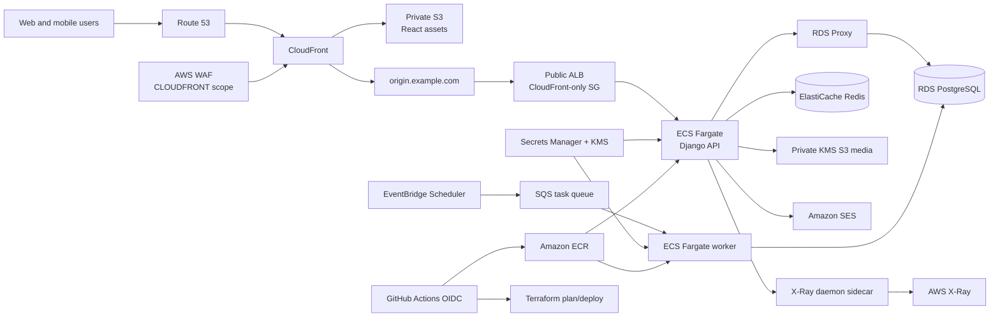

# Demand Gig Engine Terraform module architecture

This document maps the production AWS diagram to the Terraform implementation under `terraform/`. The framework uses one reusable module per AWS service or infrastructure responsibility, then composes those modules into isolated `dev` and `prod` stacks through environment-specific `.tfvars` and remote-state keys.

## Request and deployment paths



CloudFront routes `/api*`, `/accounts*`, `/admin*`, and `/share*` to Django. All other extensionless paths are rewritten by a CloudFront Function to `/index.html`, so SPA routing does not convert API 404 responses into frontend HTML.

When DNS is enabled, Terraform creates two certificates: the CloudFront viewer certificate in `us-east-1`, and a separate ALB-origin certificate in the workload region for `origin.<domain>`. CloudFront connects to the ALB over HTTPS using that origin hostname. The ALB security group accepts port 80/443 only from the AWS-managed CloudFront origin-facing prefix list, preventing direct internet access to the origin.

## Reusable module inventory

| Module | AWS responsibility | Important controls |
|---|---|---|
| `networking` | VPC, public/app/database subnets, IGW, NAT, route tables, S3 endpoint | Three subnet tiers; NAT per AZ in production |
| `security` | ALB, application, database, and Redis security groups | CloudFront-only ALB ingress; SG-to-SG application access |
| `kms` | Customer-managed encryption key | Rotation; CloudWatch Logs and CloudTrail service conditions |
| `acm` | Reusable DNS-validated TLS certificate | Instantiated separately for the `us-east-1` viewer certificate and regional ALB-origin certificate |
| `waf` | Edge Web ACL | Common rules, known-bad inputs, IP rate limiting |
| `cloudfront` | CDN, S3 OAC, API routing, SPA rewrite, headers | HTTP/2+3, TLS, WAF, OAC, security headers |
| `route53` | Alias records | A and AAAA records for viewer and ALB-origin names |
| `s3_static` | Private static/media buckets | Public-access block, ownership enforcement, versioning, encryption, TLS-only policy |
| `alb` | Application Load Balancer and target group | Invalid-header dropping, deletion protection, TLS 1.2/1.3 policy, health checks |
| `ecr` | Backend/frontend repositories | Immutable tags, KMS encryption, scan-on-push, lifecycle policy |
| `ecs_cluster` | Fargate cluster and logging | Container Insights and encrypted logs |
| `ecs_service` | API, worker, and migration task definitions/services | Read-only root FS, writable `/tmp`, secret injection, least-privilege roles, circuit breaker, autoscaling, X-Ray sidecar |
| `rds_postgres` | PostgreSQL, RDS Proxy, secrets | Private Multi-AZ option, encryption, PI, enhanced monitoring, TLS proxy |
| `redis` | ElastiCache replication group | Transit/at-rest encryption, replicas and failover |
| `sqs` | Work queue and DLQ | Long polling, SSE, redrive policy |
| `eventbridge` | Domain bus and expiry schedule | Scheduler IAM role, retries, DLQ |
| `ses` | Domain identity and DKIM | Route 53 verification and DKIM records |
| `secrets_manager` | OAuth/payment/integration credential vault | KMS encryption; Terraform ignores later secret rotations |
| `cloudwatch` | Metrics, alarms, and SNS | ALB 5xx and ECS CPU alarms |
| `cloudtrail` | Multi-region audit trail | Log validation, KMS, versioned archive, TLS-only policy |
| `guardduty` | Threat detection | Optional detector per account/region |
| `xray` | Sampling policy | X-Ray sampling rule; ECS daemon sidecar and Django SDK integration |
| `backup` | Database backup policy | Encrypted vault and daily retention plan |
| `github_oidc` | Workload identity for GitHub | Repository/branch/PR/environment subject restrictions; no long-lived AWS keys |

There are 24 module directories. The root stack has 29 module instances because `acm` is used for viewer and origin certificates, `route53` is used for viewer and origin records, `s3_static` is used for static and media buckets, and `ecs_service` is used for API, worker, and migration task definitions.

## Environment isolation

```text
terraform/envs/dev/terraform.tfvars
terraform/envs/dev/backend.hcl       # generated, ignored
terraform/envs/prod/terraform.tfvars
terraform/envs/prod/backend.hcl      # generated, ignored
```

The state bucket name includes environment and AWS account ID, and each environment uses a different state key. The intended organization model is a separate AWS account for development and production. If both stacks temporarily share one account, account-global resources such as the GitHub OIDC provider must be managed only once.

Production defaults enforce:

- Three Availability Zones and one NAT gateway per AZ.
- At least two API tasks and two workers.
- Multi-AZ PostgreSQL with RDS Proxy.
- Redis replicas and automatic failover.
- Deletion protection.
- Seven-year CloudTrail archive retention.
- GuardDuty and scheduled campaign-expiry processing.

## Deployment sequence

`terraform/scripts/deploy.sh <environment>` performs the following non-interactively after AWS credentials are available:

1. Runs native Terraform formatting and validation.
2. Creates or verifies the secure remote-state bucket.
3. Creates KMS and ECR first to break the image/infrastructure dependency cycle.
4. Builds and pushes immutable backend and frontend images.
5. Applies infrastructure with API and worker desired counts set to zero.
6. Runs a dedicated migration task definition that has no web health check.
7. Verifies the migration container exit code.
8. Applies the environment-specific API and worker counts.
9. Extracts the compiled React assets from the frontend image.
10. Publishes immutable assets with one-year cache headers and `index.html` with no-cache headers.
11. Invalidates CloudFront.

AWS credentials, OAuth/provider secrets, and—when custom DNS is enabled—the hosted zone/domain are external trust inputs and cannot be invented safely. Provider credentials may be supplied through `PROVIDER_CREDENTIALS_FILE`; everything after those inputs is automated with `-input=false` and `-auto-approve`.

## Tests and policy gates

The 27 local Go tests verify the module inventory, environment contracts, production safety values, credentials, state bootstrap, deployment order, migration gating, regional certificates, CloudFront-only origin access, SPA/API routing, Docker/Compose contracts, same-origin frontend behavior, KMS/TLS storage, tracing, ECS Exec IAM, IPv4 origin DNS, autoscaling identifiers, static cache controls, secret injection, and workflow commands. Mock binaries exercise the entire deployment script without contacting AWS.

GitHub Actions supplies the definitive native checks unavailable in an offline sandbox:

```text
terraform fmt -recursive
terraform fmt -check -recursive
terraform init -backend=false
terraform validate
TFLint
Go race tests
Checkov
AWS-backed plan on same-repository pull requests
manual environment deployment through OIDC
```

See `TERRAFORM_TEST_REPORT.md` for the exact executed and deferred test matrix.
