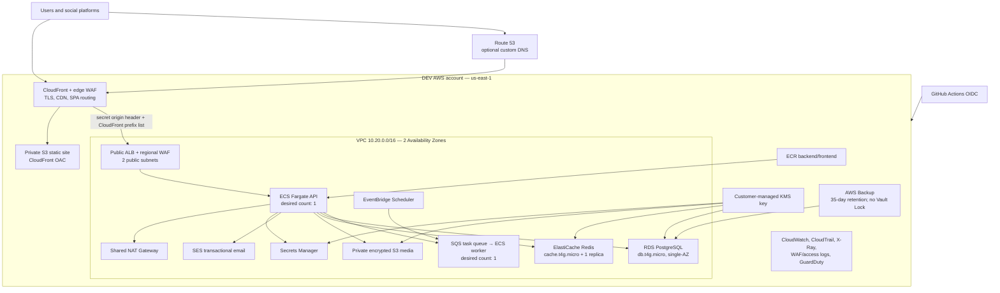
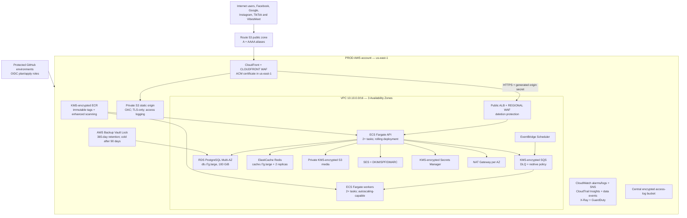
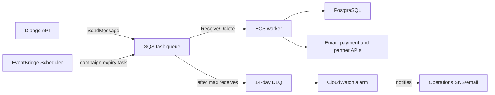
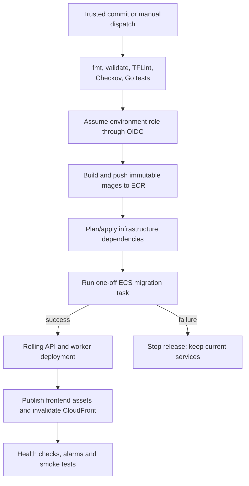

# Demand Gig Engine — AWS Terraform Platform

> **Author:** Stan Zvenigorodskiy  
> **Organization:** DevOps Lab Inc.  
> **Website:** [DevOpsLabInc.com](https://DevOpsLabInc.com)  
> **Repository:** `DevOpsLabCode/demand-gig-engine`

This directory contains the reusable Terraform platform for Demand Gig Engine. It deploys the same application topology into isolated AWS development and production accounts, with environment-specific availability, capacity, retention, deletion-protection, DNS, payment, and recovery policies.

The platform is designed around these principles:

- Separate AWS accounts and Terraform state for development and production.
- Private application, database, and cache tiers; only CloudFront and the ALB are public entry points.
- CloudFront-to-origin authentication in addition to network restrictions.
- Customer-managed encryption for supported data, queues, logs, secrets, and backups.
- Short-lived GitHub Actions credentials through OIDC; no long-lived AWS keys in GitHub.
- Reusable, narrowly scoped Terraform modules with environment composition in one root stack.
- Fail-closed production readiness checks.
- Immutable application images and a migration-before-rollout deployment sequence.
- Central audit, access, application, WAF, database, Redis, and infrastructure monitoring.
- Recovery controls that are inexpensive and removable in Dev, but durable and protected in Prod.

---

## 1. Architecture at a glance

### 1.1 Development architecture

Development uses two Availability Zones, one shared NAT Gateway, one API task, one worker task, a single-AZ PostgreSQL instance, and a small Redis replication group. It keeps the production security topology while reducing cost. Destructive cleanup is allowed where appropriate, and backup Vault Lock is disabled.



Development defaults:

| Control | Dev value | Purpose |
|---|---:|---|
| VPC | `10.20.0.0/16` | Non-overlapping address space for the Dev account. |
| Availability Zones | 2 | Validates multi-AZ subnet and routing behavior at lower cost. |
| NAT Gateways | 1 shared | Reduces non-production cost; accepts an AZ-level egress dependency. |
| API tasks | 1 × 0.5 vCPU / 1 GiB | Functional testing and integration validation. |
| Worker tasks | 1 × 0.25 vCPU / 0.5 GiB | Processes background work from SQS. |
| PostgreSQL | `db.t4g.micro`, 20 GiB, single-AZ | Low-cost non-production relational database. |
| Redis | `cache.t4g.micro` + 1 replica | Tests replication and automatic failover behavior. |
| Deletion protection | Disabled | Allows intentional teardown and recreation. |
| CloudTrail retention | 90 days | Adequate Dev investigation window with controlled cost. |
| AWS Backup | 35 days; Vault Lock off | Recoverability without immutable non-production data. |
| S3/ECR cleanup | Force delete enabled | Supports disposable Dev environments. |
| Payment adapter | `fake` | Prevents accidental real charges. |
| Production gate | Disabled | Allows CloudFront default hostname and incomplete integrations. |

### 1.2 Production architecture

Production uses three Availability Zones, one NAT Gateway per AZ, at least two API and two worker tasks, Multi-AZ PostgreSQL, a two-replica Redis deployment, deletion protection, long audit retention, and immutable AWS Backup recovery points. A plan fails until a real payment provider, monitored alarm address, custom domain, and TLS/SES prerequisites are configured.



Production defaults:

| Control | Prod value | Purpose |
|---|---:|---|
| VPC | `10.10.0.0/16` | Dedicated production address space. |
| Availability Zones | 3 | Tolerates loss of an AZ across application and subnet tiers. |
| NAT Gateways | 1 per AZ | Keeps private-tier egress local to each AZ. |
| API tasks | 2 × 1 vCPU / 2 GiB | Minimum highly available API baseline. |
| Worker tasks | 2 × 0.5 vCPU / 1 GiB | Redundant asynchronous processing. |
| PostgreSQL | `db.r7g.large`, 100 GiB, Multi-AZ | Synchronous standby and production capacity. |
| Redis | `cache.r7g.large` + 2 replicas | Multi-AZ cache availability and read capacity. |
| Deletion protection | Enabled | Protects ALB and RDS from accidental removal. |
| CloudTrail retention | 2,555 days | Approximately seven years of audit-log retention. |
| AWS Backup | 365 days; cold after 90; max 3,650 | Durable and cost-tiered database recovery. |
| Backup Vault Lock | Enabled | Becomes immutable after the configured three-day grace period. |
| S3/ECR cleanup | Force delete disabled | Prevents silent deletion of production data and images. |
| Payment adapter | Must be real | `production_readiness` rejects `fake`. |
| Production gate | Enabled | Requires alarms, custom domain, TLS, email identity, and real payments. |

> **Important:** The checked-in Prod values intentionally do not pass the production-readiness check. Replace placeholder payment, domain, certificate, SES, and alarm values with approved production facts. Do not disable `enforce_production_readiness` to bypass the gate.

---

## 2. Request, data, and background-job flows

### 2.1 Web and API request flow

1. Route 53 resolves the application hostname to CloudFront.
2. The edge WAF evaluates managed rule groups and per-IP rate limits.
3. CloudFront serves versioned frontend assets from the private S3 static bucket through Origin Access Control.
4. `/api`, account, admin, and sharing routes are sent to the ALB origin.
5. CloudFront adds a random 64-character origin-verification header stored in encrypted Terraform state.
6. The ALB security group accepts only AWS-managed CloudFront origin-facing ranges.
7. The ALB listener accepts only requests containing the expected origin header; unmatched direct-origin requests receive a fixed denial response.
8. The regional WAF independently protects the ALB.
9. The ALB forwards valid traffic to healthy ECS API tasks on the application port.
10. API tasks access PostgreSQL, Redis, SQS, media storage, SES, and Secrets Manager through task-specific IAM and security-group rules.

### 2.2 Asynchronous task flow



The API receives send-only queue permissions. Workers receive read/delete permissions. EventBridge uses a dedicated role, and the DLQ accepts redrive only from the expected source queue.

### 2.3 Deployment and migration flow



Database migrations must be backward-compatible with the currently running application version. Terraform provisions a migration task definition with desired count zero; the deployment script starts it explicitly and waits for success before updating steady-state services.

---

## 3. Repository structure

```text
terraform/
├── envs/
│   ├── dev/
│   │   ├── backend.hcl.example
│   │   └── terraform.tfvars
│   └── prod/
│       ├── backend.hcl.example
│       ├── README.md
│       └── terraform.tfvars
├── global/
│   ├── account/                  # one-time account-wide controls and OIDC
│   └── bootstrap/                # secure S3 remote-state foundation
├── modules/                      # 25 reusable service modules
├── scripts/
│   ├── bootstrap-account.sh
│   ├── bootstrap.sh
│   ├── deploy.sh
│   ├── destroy-tolerant.sh
│   ├── reconcile-existing-s3.sh
│   ├── reconcile-elasticache-service-linked-role.sh
│   ├── reconcile-rds-service-linked-role.sh
│   ├── update-provider-locks.sh
│   └── validate.sh
├── tests/                        # Go structure, contract and integration tests
├── main.tf                       # complete per-environment composition
├── variables.tf                  # validated public input contract
├── outputs.tf                    # endpoints and operational identifiers
├── providers.tf                  # regional and us-east-1 AWS providers
└── versions.tf                   # Terraform, provider and S3 backend constraints
```

The root module owns one complete environment. Account-wide singletons are deliberately kept in `global/account` so Dev and Prod environment states do not compete for ownership.

---

## 4. Terraform layer model

| Layer | Scope | Applied when | Examples |
|---|---|---|---|
| `global/bootstrap` | One state foundation per AWS account/environment | Before remote-state initialization | S3 state bucket, native S3 lockfile configuration, KMS protection. |
| `global/account` | Once per AWS account | Before application environments | GitHub IAM OIDC provider/roles, GuardDuty account controls, enhanced ECR scanning. |
| Root environment | Once for Dev and once for Prod | Every application infrastructure release | VPC, CloudFront, ALB, ECS, RDS, Redis, queues, monitoring, backup. |
| Service modules | Reusable implementation units | Called by root environment | `networking`, `waf`, `ecs_service`, `rds_postgres`, etc. |
| Environment values | Environment policy | Selected by `deploy.sh dev|prod` | CIDR, capacity, AZ count, retention, protection, DNS. |

Recommended account separation:

| AWS account | Contains | Must not contain |
|---|---|---|
| Development | Dev bootstrap, Dev account baseline, Dev environment | Production state, data, certificates, images, secrets, or roles. |
| Production | Prod bootstrap, Prod account baseline, Prod environment | Development state or broadly trusted Dev deployment principals. |
| Security/log archive (recommended future extension) | Organization CloudTrail, immutable central logs, Security Hub delegation | Application workloads. |

Use AWS Organizations SCPs to restrict regions, prevent disabling audit services, deny public S3 access, and protect production security roles. SCP design belongs above this repository because it is an organization-level responsibility.

---

## 5. Module catalog

### 5.1 Edge, DNS, and content delivery

#### `acm` — TLS certificate lifecycle

- Requests DNS-validated ACM certificates when Terraform owns DNS validation.
- Accepts an existing certificate ARN when certificates are externally managed.
- Is instantiated twice: the CloudFront viewer certificate uses the `us-east-1` provider, while the ALB origin certificate uses the workload region.
- Supports `application.example.com` at the viewer and `origin.application.example.com` at the ALB.
- Exposes a nullable certificate ARN so a Dev deployment may use the default CloudFront hostname and HTTP origin during early bootstrap.

#### `route53` — Application and origin aliases

- Creates an alias from the public application hostname to CloudFront.
- Creates A and AAAA aliases for the CloudFront viewer endpoint.
- Creates an IPv4-only origin alias to the ALB because the ALB configuration is IPv4-only.
- Is conditional on `create_dns`; external DNS remains supported through pre-existing certificate inputs.

#### `waf` — Edge and regional web firewalls

- Creates AWS WAFv2 Web ACLs using AWS-managed protections and per-IP rate limiting.
- Is instantiated at `CLOUDFRONT` scope in `us-east-1` and at `REGIONAL` scope for the ALB.
- Writes full request logs to a 365-day, KMS-encrypted CloudWatch Log Group.
- Redacts authorization and cookie fields from WAF logs.
- Protects the origin even if an edge policy is changed incorrectly.

#### `cloudfront` — CDN and secure dual-origin routing

- Uses a private S3 origin for the React SPA and the ALB for dynamic routes.
- Uses CloudFront Origin Access Control instead of public S3 access.
- Applies the edge WAF and TLS policy.
- Adds the generated origin-verification header to ALB requests.
- Supports HTTPS to the named ALB origin when a regional certificate is present.
- Uses CloudFront Functions for SPA rewrites and trusted client-IP behavior.
- Sends access logs to the centralized access-log bucket.
- Exposes distribution ID, domain, and hosted-zone ID for DNS and invalidation.

#### `alb` — Application ingress and health routing

- Creates an internet-facing Application Load Balancer across public subnets.
- Restricts accepted requests using the origin-verification header.
- Routes valid requests to the ECS API target group.
- Supports an ACM-backed HTTPS listener and controlled HTTP behavior.
- Writes access logs to the central S3 log bucket.
- Enables deletion protection in Prod.
- Publishes ARN, DNS name, zone ID, target group, and alarm dimensions.

#### `s3_static` — Private static and media object storage

The root invokes this module twice:

- `static`: private CloudFront origin for the compiled frontend.
- `media`: KMS-encrypted application media accessed by ECS task roles.

The module blocks public access, supports TLS-only policies, enables versioning/encryption controls, and sends server access logs to the centralized log bucket. Dev permits force deletion; Prod preserves data by default.

#### `access_logs` — Central service access-log destination

- Receives ALB, CloudFront, source-bucket, and CloudTrail access records.
- Establishes S3 ownership, ACL, encryption, lifecycle, and service-delivery policies in the required order.
- Uses an account-qualified name to avoid global S3 naming collisions.
- Allows force deletion only in Dev.
- Must be created before services attempt to enable access logging.

### 5.2 Networking and network security

#### `networking` — Three-tier, multi-AZ VPC

- Creates the VPC, Internet Gateway, route tables, and subnet tiers.
- Creates public subnets for ALB/NAT, private application subnets for ECS, and isolated database subnets for RDS/Redis.
- Spreads subnets across two or three Availability Zones according to `az_count`.
- Uses one shared NAT in Dev or one NAT per AZ in Prod.
- Enables encrypted VPC Flow Logs to CloudWatch through a constrained IAM role.
- Returns separate subnet lists so callers cannot accidentally place databases in public or application subnets.

No ECS task, database instance, or Redis node receives a public IP.

#### `security` — Least-privilege security-group chain

The security path is intentionally directional:

| Security group | Permitted inbound | Expected outbound |
|---|---|---|
| ALB | HTTP/HTTPS from the AWS-managed CloudFront origin prefix list | Application port to ECS task security group. |
| Application | Application port from ALB security group | PostgreSQL, Redis, HTTPS/DNS and required VPC destinations. |
| Database | PostgreSQL from application security group | Stateful return traffic only. |
| Redis | Redis TLS port from application security group | Stateful return traffic only. |

The module avoids all-protocol internet egress. Security groups reference other security groups where possible instead of copying CIDR ranges.

### 5.3 Compute and image supply chain

#### `ecr` — Backend and frontend registries

- Creates separate repositories for backend and frontend artifacts.
- Uses customer-managed KMS encryption.
- Enforces immutable image tags so an already deployed version cannot be silently replaced.
- Applies lifecycle policies to control image buildup.
- Integrates with account-wide enhanced scanning configured in `global/account`.
- Allows force deletion only in Dev.

Use commit-SHA or content-digest releases. Never deploy `latest` in Prod.

#### `ecs_cluster` — Fargate cluster foundation

- Creates the ECS cluster used by API, worker, and migration task definitions.
- Enables encrypted Container Insights and execution-command logging where configured.
- Publishes cluster ARN/name for services, monitoring, and deployment scripts.
- Centralizes cluster-level operational settings instead of duplicating them in services.

#### `ecs_service` — API, worker, and migration runtime

One reusable module is instantiated three times with intentionally different permissions:

| Instance | Desired count | Load balancer | Queue access | Primary role |
|---|---:|---|---|---|
| `backend` | Dev 1 / Prod 2 | Yes | Get attributes, send | Handle synchronous API requests. |
| `worker` | Dev 1 / Prod 2 | No | Receive, delete, inspect | Process asynchronous jobs. |
| `migration` | 0 | No | None | Run one-off Django database migrations. |

The module creates task/execution IAM roles, encrypted log groups, task definitions, health checks where applicable, deployment circuit-breaker/rollback behavior, and autoscaling controls. Runtime secrets are referenced by ARN and key, not rendered as plaintext environment variables.

### 5.4 Data, cache, queues, and scheduled work

#### `rds_postgres` — Durable relational data

- Creates a private RDS PostgreSQL deployment in isolated DB subnets.
- Encrypts storage with the environment KMS key.
- Creates or manages runtime connection secrets consumed by ECS.
- Enables Multi-AZ and deletion protection in Prod.
- Exports database logs to pre-created encrypted CloudWatch groups.
- Uses automated backup and maintenance settings appropriate to the module contract.
- Supplies the database ARN to AWS Backup.

The database is not internet-accessible. Schema changes are executed by the migration task before application rollout.

#### `redis` — Encrypted cache and transient coordination

- Creates an ElastiCache Redis replication group in isolated DB subnets.
- Enables encryption in transit and at rest.
- Uses authentication material exposed to ECS through Secrets Manager.
- Retains one day of snapshots in Dev and seven days in Prod.
- Uses at least one replica; Prod defaults to two.
- Disables immediate application of disruptive modifications to preserve controlled maintenance behavior.
- Publishes engine and slow logs to encrypted CloudWatch log groups.

Redis is a cache/coordination tier, not the system of record. Persistent business state belongs in PostgreSQL.

#### `sqs` — Background work queue and DLQ

- Creates a KMS-encrypted source queue and dead-letter queue.
- Enforces TLS through resource policies.
- Uses long polling and a visibility timeout aligned with worker processing.
- Moves repeatedly failed messages to the DLQ after the configured receive count.
- Retains DLQ messages for 14 days for investigation and replay.
- Restricts redrive to the expected source queue.

#### `eventbridge` — Campaign-expiration scheduling

- Creates a scheduler rule for recurring campaign-expiry work.
- Sends a controlled task message to SQS instead of invoking the application directly.
- Uses a dedicated IAM role, KMS encryption, retry behavior, and a DLQ target.
- Can be disabled per environment with `schedule_enabled`.

### 5.5 Secrets, identity, and integrations

#### `kms` — Environment encryption root

- Creates a customer-managed symmetric KMS key and alias.
- Enables rotation and a safe deletion window.
- Supplies encryption to supported S3, ECR, SQS, RDS, Redis, logs, secrets, and backup resources.
- Uses service- and account-constrained key policies.

Keep one independently owned key per environment. KMS aliases are unique in an account; import an existing matching alias instead of trying to recreate it.

#### `secrets_manager` — Third-party provider credential vault

- Creates one KMS-encrypted JSON secret for OAuth, payment, Meta marketing, and VibesMeet integration credentials.
- Seeds the expected schema without embedding production credentials in source control.
- Uses a 7-day deletion recovery window in Dev and 30 days in Prod.
- Exposes per-key ECS secret references such as `secret_arn:KEY::`.
- Ignores later value rotation so Terraform does not overwrite operationally rotated values.

Expected keys include:

```text
GOOGLE_OAUTH_CLIENT_ID
GOOGLE_OAUTH_CLIENT_SECRET
FACEBOOK_OAUTH_CLIENT_ID
FACEBOOK_OAUTH_CLIENT_SECRET
INSTAGRAM_OAUTH_CLIENT_ID
INSTAGRAM_OAUTH_CLIENT_SECRET
TIKTOK_OAUTH_CLIENT_KEY
TIKTOK_OAUTH_CLIENT_SECRET
STRIPE_SECRET_KEY
STRIPE_WEBHOOK_SECRET
META_APP_ID
META_APP_SECRET
META_PIXEL_ID
META_CONVERSIONS_API_TOKEN
VIBESMEET_ACCESS_TOKEN
VIBESMEET_WEBHOOK_SECRET
```

Never put real values in `.tfvars`, shell history, workflow YAML, a Terraform plan artifact, or Git.

#### `ses` — Authenticated transactional email

- Creates or consumes an SES domain identity.
- Publishes DKIM, SPF/MAIL FROM, and DMARC DNS records when Terraform owns DNS.
- Uses `p=none` in Dev and `p=quarantine` in Prod.
- Grants the API/worker only the identity-level send permissions they require.
- Allows an externally verified identity through `ses_identity_arn`.

SES production access, sending limits, complaint handling, bounce handling, suppression strategy, and message templates remain operational prerequisites.

#### `github_oidc` — Environment release permissions

- Creates environment-specific GitHub plan/apply or deployment roles and least-privilege policies.
- Restricts trust to the configured organization and repository.
- Does not allow pull requests to assume deployment roles.
- Grants scoped ECR push and ECS deployment capabilities.
- Applies the configured permissions boundary.

The account-wide GitHub OIDC provider is owned by `global/account`, not by each environment.

### 5.6 Observability, audit, detection, and recovery

#### `cloudwatch` — Logs, alarms, dashboards, and notification

- Monitors ALB health/errors/latency, ECS capacity, RDS, Redis, SQS/DLQ, and CloudFront.
- Creates an SNS topic with an optional email subscription.
- Encrypts supported alarm-notification paths with KMS.
- Provides centralized operational visibility for API and worker services.
- Requires the subscription recipient to confirm the SNS email subscription.

In Prod, `alarm_email` must be a monitored on-call or operations mailbox—not a personal address that may be ignored.

#### `cloudtrail` — AWS API audit trail

- Creates an encrypted multi-region trail with log-file validation.
- Stores audit events in a protected S3 bucket and records delivery access logs.
- Retains 90 days in Dev and approximately seven years in Prod.
- Adds S3 data events for static/media buckets in Prod.
- Enables CloudTrail Insights in Prod.
- Uses tightly constrained bucket and KMS policies.

For a mature organization, replicate trails to a dedicated log-archive account and monitor attempts to stop logging.

#### `guardduty` — Managed threat detection

- Enables or references the regional GuardDuty detector for threat findings.
- Must be coordinated with `global/account`, because a detector is an account/region singleton.
- Should forward high-severity findings to a centrally owned response workflow.

#### `xray` — Distributed request tracing

- Creates the application sampling rule.
- Limits routine sampling to control cost while preserving a request reservoir.
- Supports API tracing through the sidecar/daemon configuration.
- Is disabled for one-off migration tasks.

The long-term modernization path is AWS Distro for OpenTelemetry so traces, metrics, and logs use a vendor-neutral collector.

#### `backup` — Database recovery and immutability

- Creates an encrypted AWS Backup vault, plan, selection role, and RDS selection.
- Applies environment-specific retention and cold-tier settings.
- Enables Compliance-mode Vault Lock in Prod.
- Leaves Vault Lock disabled in Dev so disposable data can be removed.

**Vault Lock warning:** after the changeable window expires, Compliance-mode retention controls cannot be weakened. Test restoration, lifecycle, and teardown behavior in a non-production account before enabling the production lock.

---

## 6. Account-wide and bootstrap stacks

### 6.1 `global/bootstrap`

Terraform cannot use an S3 backend until the backend exists. Bootstrap it first with local state and tightly controlled administrator credentials. The state foundation should provide:

- A globally unique S3 bucket name.
- Versioning.
- Block Public Access.
- Encryption.
- TLS-only bucket access.
- Native S3 state locking (`use_lockfile = true` in backend configuration).
- A lifecycle and recovery process for old state versions.
- Access logging or organization audit coverage.

Do not place application resources in bootstrap state.

### 6.2 `global/account`

Apply this stack once in each workload account. It owns resources that cannot safely be duplicated by Dev/Prod state:

- GitHub Actions IAM OIDC provider.
- Environment trust and deployment roles as defined by the stack.
- GuardDuty detector/features.
- Enhanced ECR registry scanning configuration.
- Account-level supporting policies and boundaries.

The first apply must use a trusted local or federated administrator because GitHub federation does not exist yet.

---

## 7. Prerequisites

### Required tools

- Terraform `>= 1.15.0, < 1.16.0`.
- AWS provider `~> 6.57.1`.
- AWS CLI v2.
- Docker with BuildKit.
- Git and `jq`.
- Go 1.23+ for Terraform contract tests.
- TFLint and Checkov for the complete local security gate.

### Required AWS preparation

- Separate Dev and Prod AWS accounts are strongly recommended.
- An approved region; the supplied environment values use `us-east-1`.
- Route 53 hosted zone if Terraform manages public DNS.
- ACM certificates when DNS/certificate lifecycle is external.
- SES identity and production sending approval.
- GitHub environments named for Dev and Prod, each with branch protection and required reviewers.
- A secure process to populate OAuth, Stripe, Meta, and VibesMeet secrets.
- Service quotas reviewed for VPC, Elastic IP, NAT Gateway, Fargate, RDS, ElastiCache, CloudFront, WAF, SES, and KMS.

### Recommended operator identity

Use AWS IAM Identity Center or another federated identity with MFA. Do not run routine deployments as the root user, and do not create long-lived access keys solely for CI.

---

## 8. First-time setup

### Step 1 — Authenticate and confirm the target account

```bash
aws sts get-caller-identity
aws configure get region
```

Before every bootstrap or apply, compare the returned account ID to the approved Dev or Prod account inventory.

### Step 2 — Review environment values

```bash
sed -n '1,240p' terraform/envs/dev/terraform.tfvars
sed -n '1,260p' terraform/envs/prod/terraform.tfvars
```

Never reuse the same VPC CIDR across accounts that may later be connected through Transit Gateway, peering, VPN, or shared services.

### Step 3 — Bootstrap remote state

Use the repository bootstrap script:

```bash
./terraform/scripts/bootstrap.sh dev
./terraform/scripts/bootstrap.sh prod
```

Then copy the generated/approved backend values from each `backend.hcl.example` into a non-secret, environment-specific backend file. Backend files identify buckets and keys; credentials must come from AWS federation or environment configuration, not from the file.

Example shape:

```hcl
bucket       = "demand-gig-engine-dev-123456789012-tfstate"
key          = "demand-gig-engine/dev/terraform.tfstate"
region       = "us-east-1"
encrypt      = true
use_lockfile = true
```

### Step 4 — Apply account-wide controls

```bash
./terraform/scripts/bootstrap-account.sh
terraform -chdir=terraform/global/account init -backend-config=backend.hcl
terraform -chdir=terraform/global/account plan -out=account.tfplan
terraform -chdir=terraform/global/account apply account.tfplan
```

Perform this separately in Dev and Prod accounts with distinct backend configuration and credentials.

### Step 5 — Validate locally

```bash
./terraform/scripts/validate.sh
```

The expected gate includes formatting, initialization without a remote backend, native validation, linting, static security checks, custom security-invariant checks, and Go tests.

### Step 6 — Create and review an environment plan

```bash
terraform -chdir=terraform init \
  -backend-config=envs/dev/backend.hcl

terraform -chdir=terraform plan \
  -var-file=envs/dev/terraform.tfvars \
  -out=dev.tfplan

terraform -chdir=terraform show dev.tfplan
```

For production, substitute the Prod paths and require a second-person review of the saved plan.

### Step 7 — Deploy the application

```bash
./terraform/scripts/deploy.sh dev
./terraform/scripts/deploy.sh prod
```

The deployment script coordinates image publication, infrastructure changes, migration execution, rolling service updates, frontend publication, and CloudFront invalidation. Prefer this path over a raw `terraform apply` for an application release.

---

## 9. Production configuration checklist

The following checked-in Prod placeholders must be replaced before planning a live deployment:

```hcl
payment_provider = "stripe"
alarm_email      = "oncall@example.com"
create_dns       = true
domain_name      = "app.example.com"
hosted_zone_id   = "Z0123456789EXAMPLE"
```

If DNS is managed outside Terraform:

```hcl
create_dns             = false
domain_name            = "app.example.com"
viewer_certificate_arn = "arn:aws:acm:us-east-1:123456789012:certificate/..."
origin_certificate_arn = "arn:aws:acm:us-east-1:123456789012:certificate/..."
ses_identity_arn       = "arn:aws:ses:us-east-1:123456789012:identity/example.com"
```

Confirm all of the following:

- The viewer certificate is in `us-east-1` and covers the public hostname.
- The origin certificate is in the workload region and covers `origin.<domain>`.
- DNS aliases are correct and no stale direct-ALB public record exists.
- Stripe live-mode keys and webhook signing secret are present.
- OAuth redirect URIs exactly match the canonical HTTPS application URL.
- Meta/Facebook allowed domains and privacy-policy URLs are published.
- SES identity is verified and the account is out of the SES sandbox.
- SNS alarm email subscription is confirmed.
- RDS deletion protection and Multi-AZ remain enabled.
- API desired count remains at least two.
- Redis has at least one replica; the supplied Prod baseline uses two.
- Backup Vault Lock retention is approved by legal/compliance and restore-tested.
- Dev and Prod state buckets, roles, KMS keys, secrets, and accounts are distinct.
- A rollback owner and maintenance window are identified.

---

## 10. Runtime secret management

After the initial environment apply, retrieve the provider secret ARN:

```bash
terraform -chdir=terraform output -raw provider_credentials_secret_arn
```

The supported non-interactive deployment path is:

```bash
PROVIDER_CREDENTIALS_FILE=/secure/path/provider-credentials.json \
  ./terraform/scripts/deploy.sh dev
```

The JSON file must be readable only by the operator, live outside the repository, and be securely deleted according to organizational endpoint policy. Prefer CI secret injection or a short-lived secret-delivery system over a persistent workstation file.

Rotation procedure:

1. Create a new provider credential without revoking the old one.
2. Update the Secrets Manager JSON value.
3. Trigger a controlled ECS deployment so tasks read the new value.
4. Validate login, webhook, payment, and integration flows.
5. Revoke the old provider credential.
6. Record the rotation in the change-management system without recording the secret.

---

## 11. GitHub Actions and OIDC

`.github/workflows/terraform.yml` provides separate validation, real-plan, and apply behavior.

### Pull requests

Pull requests should run without AWS credentials:

- `terraform fmt -check -recursive`
- Terraform initialization with `-backend=false`
- `terraform validate`
- TFLint
- Checkov
- Custom Terraform/security contract validation
- Go tests with race detection

Untrusted pull-request code must never receive a role that can read state, secrets, or AWS resources.

### Trusted Dev plan

After code reaches the trusted branch, GitHub assumes `AWS_TERRAFORM_PLAN_ROLE_ARN` through OIDC. The plan role should have read access plus only the minimal APIs Terraform requires to refresh state and calculate a plan.

### Manual apply

Manual workflow dispatch assumes `AWS_TERRAFORM_APPLY_ROLE_ARN`. Protect the GitHub Prod environment with required reviewers, deployment branch restrictions, and environment-scoped variables/secrets.

Recommended GitHub environment variables:

```text
AWS_TERRAFORM_PLAN_ROLE_ARN
AWS_TERRAFORM_APPLY_ROLE_ARN
AWS_REGION
TF_STATE_BUCKET
TF_STATE_KEY
```

Do not configure `AWS_ACCESS_KEY_ID` or `AWS_SECRET_ACCESS_KEY` for the workflow.

---

## 12. Validation and quality gates

Run the full repository validation before opening a pull request:

```bash
./terraform/scripts/validate.sh
```

Run Terraform-native integration tests when credentials and dependencies are available:

```bash
cd terraform/tests
go test -tags=integration -count=1 -v ./...
```

Run contract tests with race detection:

```bash
cd terraform/tests
go test -race -count=1 -v ./...
go vet ./...
```

Minimum change gate:

| Gate | Required result |
|---|---|
| Formatting | No Terraform formatting difference. |
| Initialization | Providers resolve using committed lock selections. |
| Native validation | All modules validate. |
| Lint | No unapproved TFLint errors. |
| Security scan | No unreviewed blocking Checkov findings. |
| Custom invariants | Required encryption, OIDC, WAF, protection, and workflow controls remain present. |
| Go tests | Contract, script, and orchestration tests pass. |
| Plan review | No unexpected deletion, replacement, public exposure, IAM expansion, or encryption downgrade. |

When provider constraints intentionally change, run `terraform/scripts/update-provider-locks.sh` and review every lockfile change. Never delete lockfiles to silence a provider-resolution problem.

---

## 13. Plan-review standard

Every reviewer should explicitly check:

### Security

- New public endpoints, `0.0.0.0/0`, or `::/0` rules.
- Broader IAM actions, wildcard resources, trust subjects, or `iam:PassRole` expansion.
- KMS key-policy or resource-policy changes.
- New plaintext parameters, outputs, user data, or environment variables.
- Disabled WAF, GuardDuty, CloudTrail, flow logs, access logs, or TLS enforcement.
- Public S3 access, ACL changes, or weakened Origin Access Control.

### Reliability

- RDS/Redis replacement, failover behavior, engine-version changes, or maintenance timing.
- Reduced API/worker desired counts.
- Removal of NAT, routes, subnets, target groups, alarms, or backups.
- Changes that force a CloudFront or ALB replacement.
- Migration compatibility with the current application version.

### Data protection

- Any destroy/recreate action on RDS, KMS, Secrets Manager, S3, backup vault, or state.
- Shorter retention, disabled versioning, disabled deletion protection, or force-destroy changes.
- Changes to Vault Lock. After the grace period, some changes are intentionally irreversible.

### Cost

- Additional NAT Gateways, CloudFront/WAF logging, data events, high-volume logs, database/cache sizes, retained snapshots, or cross-AZ data transfer.
- Autoscaling maximums and alarm thresholds.

---

## 14. Observability and operational readiness

### Logs

The platform produces or stores:

- CloudFront access logs.
- ALB access logs.
- S3 server access logs.
- WAF full request logs with sensitive headers redacted.
- ECS API and worker application logs.
- PostgreSQL logs.
- Redis engine and slow logs.
- VPC Flow Logs.
- CloudTrail management events, Insights, and Prod S3 data events.
- X-Ray traces.

Log groups with security or infrastructure value use long retention and customer-managed encryption where supported. Application logging must use structured JSON and must not contain access tokens, passwords, payment data, session cookies, or unnecessary personal data.

### Alarms

At minimum, monitor:

- ALB unhealthy hosts, target 5xx, load-balancer 5xx, and latency.
- ECS running task count, CPU, memory, and deployment failures.
- RDS CPU, storage, connections, latency, and failover events.
- Redis CPU, memory pressure, evictions, replication lag, and failover.
- SQS queue age/depth and any DLQ message.
- CloudFront error rate.
- WAF blocked-request anomalies.
- Backup job failure.
- CloudTrail delivery failure or security-service disablement.
- GuardDuty high-severity findings.

### Runbook ownership

Each alarm must include an owner, severity, user impact, diagnostic link, immediate mitigation, escalation path, and closure condition. An alarm without an actionable response is operational noise.

---

## 15. Backup, restore, and disaster recovery

### Recovery objectives

Define and approve business recovery objectives before launch:

| Component | Recommended strategy |
|---|---|
| PostgreSQL | Multi-AZ for local availability; AWS Backup and automated backups for point-in-time/data recovery. |
| Redis | Replicas and snapshots, but rebuild cache from the database whenever possible. |
| Static frontend | Rebuild from source and immutable image/artifact version; S3 versioning assists rollback. |
| Media | S3 versioning plus separately approved replication/backup based on business criticality. |
| Secrets | Rotate from provider systems; do not depend solely on restoring an old secret value. |
| Terraform state | S3 versioning, encryption, native lockfile, restricted access, and tested version recovery. |

### Restore test

At least quarterly for Prod:

1. Select an approved recovery point.
2. Restore to isolated subnets and a new identifier.
3. Prevent outbound integration calls and email.
4. Validate database integrity, schema version, critical tables, and row counts.
5. Run application smoke tests against the restored database.
6. Measure recovery time and data-loss window.
7. Destroy the isolated test resources after evidence is retained.
8. Document deviations and assign remediation owners.

A successful backup job is not proof of recoverability; a successful restore test is.

---

## 16. Scaling and performance

### API

- Keep at least two Prod tasks across AZs.
- Scale on CPU, memory, ALB request count, and latency rather than CPU alone.
- Ensure target deregistration delay and application shutdown allow in-flight requests to complete.
- Use load tests to validate connection-pool and worker-thread settings.

### Workers

- Scale using SQS backlog per task and age of oldest message.
- Make jobs idempotent because SQS delivery is at least once.
- Set visibility timeout longer than normal processing time and extend it for long-running jobs.
- Alarm on DLQ count greater than zero.

### PostgreSQL

- Use connection pooling and set task connection limits below the database maximum.
- Enable Performance Insights or the approved database observability equivalent.
- Test major version upgrades in Dev with a production-like snapshot.
- Prefer online/backward-compatible schema migrations.

### Redis

- Treat evictions and memory pressure as capacity signals.
- Do not store unique durable business state only in Redis.
- Test replica promotion and client reconnect behavior.

### CloudFront

- Cache immutable asset names for a long duration.
- Give `index.html` a short/no-cache policy so deployments take effect promptly.
- Avoid forwarding unnecessary headers/cookies/query strings that reduce cache efficiency.

---

## 17. Cost controls

The largest steady-state cost drivers are normally NAT Gateways/data processing, RDS, Redis, WAF/CloudFront traffic and logging, CloudWatch ingestion, CloudTrail data events, and retained backups.

Recommended controls:

- Keep the shared Dev NAT design unless availability testing needs one per AZ.
- Schedule non-production ECS desired counts down only when test expectations allow it.
- Right-size RDS/Redis from measured utilization, not guesses.
- Apply log retention deliberately and avoid verbose debug logging in Prod.
- Use S3 lifecycle transitions for old logs and approved backup cold storage.
- Add AWS Budgets and Cost Anomaly Detection at the account level.
- Require `Project`, `Environment`, `Owner`, `CostCenter`, and `Repository` tags.
- Review CloudFront price class against the actual audience; the supplied baseline is `PriceClass_100`.

Never reduce encryption, audit, backup, or availability controls solely to meet a short-term cost target without an explicit risk decision.

---

## 18. Safe changes and release strategy

### Terraform change workflow

1. Create a short-lived branch.
2. Modify the smallest responsible module and its tests/documentation.
3. Run formatting, validation, lint, security scans, and Go tests.
4. Open a pull request and review the complete plan.
5. Deploy to Dev.
6. Run application, security, migration, failure, and rollback tests.
7. Promote the same immutable image digest to Prod.
8. Obtain protected-environment approval.
9. Apply the reviewed Prod plan.
10. Verify health, logs, alarms, critical journeys, and background processing.

### Application rollback

Rollback should redeploy the last known-good image digest. Database rollback is separate: prefer forward-fix migrations and backward-compatible expand/migrate/contract changes. Never assume reverting an image safely reverses a database schema.

### Infrastructure rollback

Terraform is not a universal rollback engine. Reapplying old code may propose destructive replacements. Create a fresh plan, review current state and data risk, and choose recovery from snapshots/backups when appropriate.

---

## 19. Destroy and cleanup safety

Development can be intentionally disposable, but destruction is still a reviewed operation:

```bash
./terraform/scripts/destroy-tolerant.sh dev
```

Before Dev destruction:

- Confirm the AWS account ID and environment name.
- Confirm no shared DNS zone, certificate, OIDC provider, or account-level detector is in the environment state.
- Export any required test evidence.
- Empty or preserve buckets/ECR only according to the approved cleanup procedure.
- Check for RDS snapshots and Backup recovery points.

Production destruction is not a normal workflow. RDS and ALB deletion protection, non-force-deletable buckets/repositories, Secrets Manager recovery, and Vault Lock are intentional barriers. Do not disable them as a convenience. A Prod retirement requires an approved data-retention and decommission plan.

If AWS Backup reports `Backup vault cannot be deleted because it contains recovery points`, retain the vault until lifecycle expiration or perform an explicitly approved recovery-point disposition. Compliance-mode locked recovery points cannot be forcibly deleted.

---

## 20. Troubleshooting

### KMS alias already exists

Symptom:

```text
AlreadyExistsException: An alias with the name alias/demand-gig-engine-<env> already exists
```

Cause: the alias exists outside the current state, often after a partial apply or recreated backend.

Resolution: identify the exact account/region, inspect the alias and key, and import the existing resource if it belongs to this stack. Do not delete an encryption key merely to make Terraform pass.

```bash
aws kms list-aliases --region us-east-1
terraform -chdir=terraform import \
  'module.kms.aws_kms_alias.this' \
  'alias/demand-gig-engine-dev'
```

Confirm the exact resource address from the module before importing.

### Backup vault contains recovery points

Terraform cannot delete a non-empty vault. Review recovery points, retention dates, legal hold, and Vault Lock mode. In Dev, wait for expiration or remove only explicitly disposable, unlocked points. In Prod, follow retention policy; locked recovery points may be immutable.

### GuardDuty detector already exists

GuardDuty permits one detector per account/region. Ensure `global/account` owns it and import/reconcile the existing detector. Do not create one detector from each environment state.

### ECR enhanced scanning access denied or subscription error

Enhanced scanning is account/region configuration and may depend on Inspector activation and permissions. Apply `global/account`, verify Amazon Inspector/ECR scanning availability, and ensure the deployment role has only the required registry APIs.

### Service-linked role already exists

RDS or ElastiCache service-linked roles are account-wide singletons. Use the provided reconciliation scripts after confirming the role is legitimate:

```bash
./terraform/scripts/reconcile-rds-service-linked-role.sh
./terraform/scripts/reconcile-elasticache-service-linked-role.sh
```

### State bucket does not exist

Run the one-time bootstrap in the correct account and region, then verify the `backend.hcl` bucket/key. Never point Dev and Prod at the same state key.

### CloudFront returns 403

Check, in order:

1. DNS points to the intended distribution.
2. Distribution deployment status is complete.
3. S3 Origin Access Control and bucket policy match.
4. SPA rewrite behavior is attached to the S3 behavior.
5. API paths match the ALB behavior.
6. The ALB rule receives the generated origin-verification header.
7. Regional and edge WAF logs do not show a block.
8. Target group health checks pass.
9. Django `ALLOWED_HOSTS`, CSRF trusted origins, and proxy headers match the application URL.

### OAuth login is missing or fails

- Confirm the provider keys exist in the expected Secrets Manager JSON object.
- Force a new ECS deployment after rotating secrets.
- Confirm frontend provider feature flags/build variables.
- Match callback URLs exactly, including scheme, hostname, path, and trailing slash.
- Confirm provider apps are live/approved for non-test users.
- Confirm CloudFront routes callback paths to the API rather than the SPA origin.
- Review ECS logs without printing tokens or authorization codes.

### Production plan fails readiness checks

This is expected until all production prerequisites are supplied. Fix `payment_provider`, `alarm_email`, custom-domain/DNS, viewer/origin certificates, and SES identity configuration. Do not set `enforce_production_readiness = false` in Prod.

---

## 21. Security model summary

| Area | Implemented control | Operational responsibility |
|---|---|---|
| Identity | GitHub OIDC, scoped roles, permissions boundary | Review trust subjects and GitHub environment protection. |
| Edge | CloudFront WAF, regional ALB WAF, rate limits | Tune exclusions from evidence; monitor blocks. |
| Origin | CloudFront prefix list plus random origin header | Rotate through controlled Terraform change if exposed. |
| Network | Tiered private subnets and SG-to-SG access | Review all ingress/egress changes. |
| Data | KMS encryption and private service endpoints/paths | Control key administrators and grants. |
| Secrets | Secrets Manager injection into ECS | Rotate provider credentials and restrict read access. |
| Images | ECR encryption, immutable tags, enhanced scanning | Patch base images and enforce severity policy. |
| Audit | CloudTrail, WAF/access logs, VPC Flow Logs | Centralize, alert, retain, and investigate. |
| Detection | GuardDuty and CloudWatch alarms | Route findings to owned incident response. |
| Recovery | Automated backups, Prod Vault Lock, deletion protection | Test restoration and approve retention. |
| Application | Secure cookies, trusted proxy header, TLS at viewer | Maintain Django dependencies, auth, CSRF/CORS and webhook validation. |

Terraform reduces configuration risk; it does not replace threat modeling, application security testing, incident response, access reviews, penetration testing, or compliance evidence management.

---

## 22. Known boundaries and recommended next improvements

The current architecture is a strong single-region baseline. Before high-volume or regulated production use, evaluate:

- AWS Organizations security/log-archive accounts and organization CloudTrail.
- AWS Config, Security Hub, Inspector, IAM Access Analyzer, Macie, and centralized finding aggregation.
- VPC endpoints for ECR API/DKR, S3, CloudWatch Logs, Secrets Manager, KMS, SQS, and STS to reduce NAT dependency and public service paths.
- AWS Distro for OpenTelemetry instead of the legacy X-Ray daemon path.
- Cross-region database/media recovery based on approved RTO/RPO.
- RDS Proxy if task scaling or connection counts justify it.
- Shield Advanced only if the risk/cost model supports it.
- Synthetic canaries for login, campaign creation, deposit, refund, and partner webhook flows.
- Automated secret rotation where provider APIs support overlapping credentials.
- Policy-as-code tests for organization-specific tagging, regions, resource sizes, and data residency.
- Blue/green ECS deployment if release risk requires traffic shifting beyond rolling deployment.

These are roadmap recommendations, not claims about resources currently created by this root stack.

---

## 23. Outputs and post-deployment verification

Inspect all non-sensitive outputs:

```bash
terraform -chdir=terraform output
```

Common outputs include:

- Canonical application and CloudFront URLs.
- ECR repository URLs.
- ECS cluster/service identifiers.
- GitHub Actions role ARNs.
- Static/media bucket identifiers.
- Provider credential secret ARN.
- Queue/DLQ identifiers.
- Database/cache operational identifiers.

Post-deployment smoke test:

1. Open the canonical HTTPS URL.
2. Verify the certificate chain, hostname, HSTS/security headers, and redirect behavior.
3. Load a static asset twice and confirm CloudFront cache behavior.
4. Call the API health endpoint through CloudFront.
5. Verify direct ALB requests are denied.
6. Verify target group health across the expected AZs.
7. Create a test campaign and enqueue/process a background task.
8. Test supported OAuth login callbacks.
9. In non-production or an approved live test, validate Stripe webhook signature and idempotency.
10. Confirm application, WAF, ALB, CloudFront, database, Redis, and audit logs arrive.
11. Confirm alarms are `OK` and the notification subscription is confirmed.
12. Confirm the latest AWS Backup job succeeds.

---

## 24. Documentation index

- [`../docs/terraform-module-architecture.md`](../docs/terraform-module-architecture.md) — module dependency blueprint.
- [`../docs/AWS_PRODUCTION_ARCHITECTURE.md`](../docs/AWS_PRODUCTION_ARCHITECTURE.md) — broader production architecture.
- [`../docs/TERRAFORM_MODULE_DEEP_AUDIT.md`](../docs/TERRAFORM_MODULE_DEEP_AUDIT.md) — module-by-module implementation audit.
- [`../docs/CHECKOV_REMEDIATION.md`](../docs/CHECKOV_REMEDIATION.md) — security finding and remediation mapping.
- [`../TERRAFORM_TEST_REPORT.md`](../TERRAFORM_TEST_REPORT.md) — executed and deferred test matrix.
- [`../SECURITY_TESTING.md`](../SECURITY_TESTING.md) — repository security gates.
- Every directory under [`modules/`](modules/) — generated input, output, resource, control, and usage documentation.

---

## 25. Ownership

Infrastructure changes should identify a technical owner, security reviewer, deployment approver, and rollback owner. Production access should be time-bound, attributable, MFA-protected, and reviewed periodically.

This Terraform framework and its documentation are maintained by **Stan Zvenigorodskiy / DevOps Lab Inc.**
